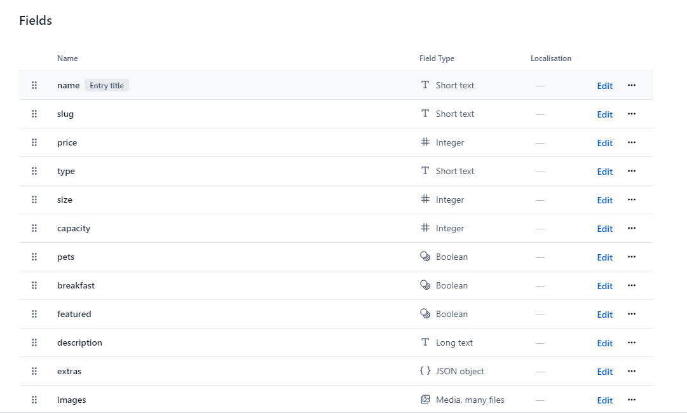

# React Beach Resort


_Languages:_
<br>

- 🌎 Também disponível em pt-BR aqui 👉 [Aqui](https://github.com/paulomonezi/beach-resort-react/blob/main/README.ptBR.md)

## 🔗 Link
https://beach-resort-react-lilac.vercel.app/

## 💻 What is this project about?

This is a room-renting app for a luxurious resort, the user can navigate through the page and filter the rooms according to his preferences, like:

- price range
- room size
- room type
- guests number
- breakfast included
- pets allowed

### 🧰 Tech Stack

- React
- Context API
- React Router Dom
- Contentful CMS
  <br>

### 🔌 Installation

1. Clone the repo
   ```sh
   git clone git@github.com:paulomonezi/beach-resort-react.git
   ```
2. Install NPM packages

   ```sh
   npm install
   ```

3. Retrieving data
   <br>

- We're using a CMS to add data externally:
- Create an account in Contentful https://app.contentful.com/
- Create a content model like this
  <br><br>

  <br>
- Add an entry and publish
  <br>

4. Create and set your API Key

- Go to contentful https://app.contentful.com/, create your API Key and set the `Space ID` and `access token` on .env files
  ```sh
      VITE_KEY_SPACE=YOUR-KEY-HERE
      VITE_ACCESS_TOKEN=YOUR TOKEN HERE
  ```
  Then set the values on `Contentful.jsx`
    ```sh
    import { createClient } from "contentful"
    import React from "react"

    export default createClient({
    space: import.meta.env.VITE_KEY_SPACE,
    accessToken: import.meta.env.VITE_ACCESS_TOKEN
    })

  ```

5. Use local data

- As an alternative, you can work with local data, with `data.jsx` file located at the root of project, simply changing `getData()` function on `context.jsx` to import and filter the data locally instead.

6. Run the application

   ```sh
   npm run dev
   ```

7. Usefull links

Contentful Docs https://www.contentful.com/help/contentful-overview/
<br>
Content Model https://www.contentful.com/help/content-modelling-basics/
<br>
