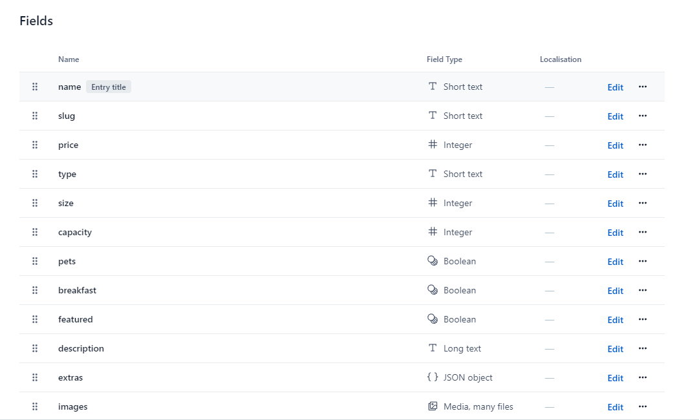

# React Beach Resort

_Languages:_
<br>

- 🌎 Also avaliable in english 👉 [Here](https://github.com/paulomonezi/beach-resort-react/blob/main/README.md)

## 💻 Sobre o projeto

O projeto se trata de um app para alugueis de quartos em um resort de luxo, o usuário pode navegar pela página e filtrar os quartos de acordo com suas preferências, como por exemplo:

- preço
- tamanho
- tipo de quarto
- número de hóspedes
- café incluso
- pets permitidos

### 🧰 Tech Stack

- React
- Context API
- React Router Dom
- Contentful CMS
  <br>

### 🔌 Instalação

1. Clone o repo
   ```sh
   git clone git@github.com:paulomonezi/beach-resort-react.git
   ```
2. Instale os pacotes

   ```sh
   npm install
   ```

3. Buscando os dados
   <br>

- Estamos usando um CMS para adicionar os dados de forma externa:
- Crie uma conta no Contentful https://app.contentful.com/
- Crie um content model como esse
  <br><br>

  <br>
- Adicione uma entry e clique em publish
  <br>

4. Criando e configurando sua chave API

- Vá até o site do contentful https://app.contentful.com/, clique em settings e API Keys e em seguida Add API key, crie sua chave e coloque os valores de `Space ID` e `access token` nos arquivos de ambiente .env

  ```sh
      VITE_KEY_SPACE=SUA-CHAVE-AQUI
      VITE_ACCESS_TOKEN=SEU-TOKEN-AQUI
  ```
  Após isso, importe os valores através do `Contentful.jsx`
    ```sh
    import { createClient } from "contentful"
    import React from "react"

    export default createClient({
    space: import.meta.env.VITE_KEY_SPACE,
    accessToken: import.meta.env.VITE_ACCESS_TOKEN
    })

  ```

5. Use dados locais

- Como uma alternativa, você pode trabalhar com dados locais com o arquivo `data.jsx` que está na raiz do projeto, simplesmente alterando a função `getData()` no `context.jsx` para importar e filtrar os dados localmente, ao invés de fazer isso pelo CMS

6. Rode a aplicação

   ```sh
   npm run dev
   ```

7. Links úteis

Contentful Docs https://www.contentful.com/help/contentful-overview/
<br>
Content Model https://www.contentful.com/help/content-modelling-basics/
<br>
